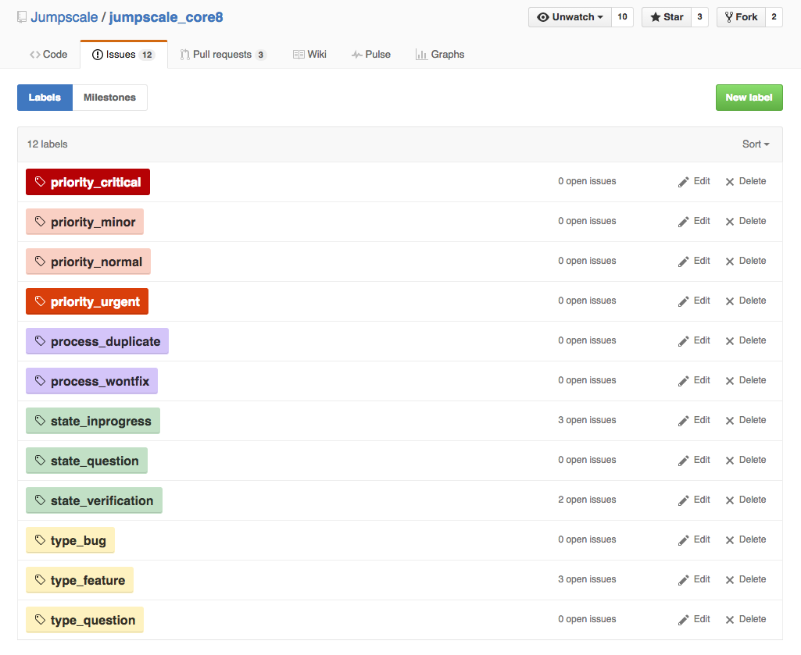
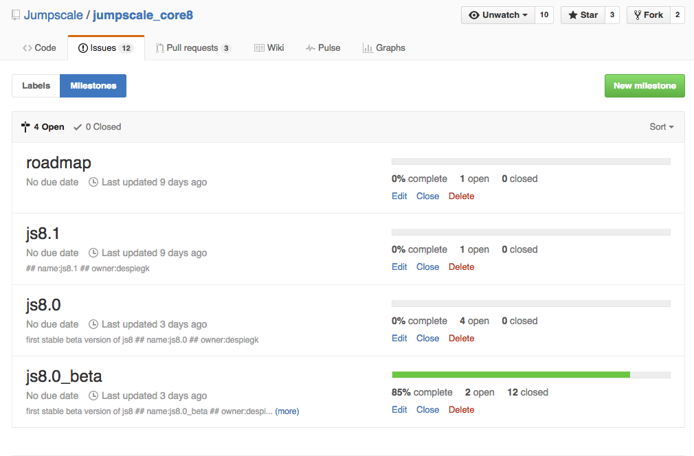

## Planning

### Introduction

Planning always happens in an **organization** repository, such as:

- org_development (engineering)
- org_support
- org_quality
- org_internalit
- org_marketing
- org_product
- org_finance
- org_legal
- org_hr

Remember that organization repositories should only be created in GitHub organizations of type "projorg" such as [gig-projects](https://github.com/gig-projects).

Also in case of planning related to product development, the planning should only happen in an organization repository, even while the actual code exists in a **code** repository, which can only exist in GitHub organizations of type "prodorg" such as [jumpscale](https://github.com/jumpscale).
 
So in other words, for all product development there will always be two repositories:

- One code repository in a "prodorg" organization where the actual **code** exists
- One organization repository in a "projorg" organization where the **planning** happens

As a consequence you will have two "types" of milestones involved:
- A **non-time based** milestone in the code repository - here we typically use a release number such as "8.1", with no specific due date
- A **time based** milestone in the organization repository - here we typically use a name/label such as "critical_path" or "summer" with a specific due date

In what follows we discuss the steps for planning related to product development.


#### Step 0: Prepare

- Per company there is a GitHub organization of type "projorg", e.g. [gig-projects](https://github.com/gig-projects)
  - Here you will have an organization repository, e.g. [gig-projects/org_development](https://github.com/gig-projects/org_development)
- Per group of products there is GitHub organization of type "prodorg", e.g. [jumpscale](https://github.com/jumpscale)
  - Here you will have/create one or more code repositories, e.g. [Jumpscale/jumpscale_core8](https://github.com/Jumpscale/jumpscale_core8)
  - Make sure all your code repositories are well prepared, having the right labels and milestone:
  
  
  
  
   
  - Use our tools to set the labels, ... 
- Make sure all people have access


#### Step 1: Roadmap / strategic planning

- In the home repository of the "projorg" organization
  - Update README.md (```$homerepo/Readme.md```)
    - Link to all documents mentioned below 
  - Create terminology document (```$homerepo/terminology.md```)
    - Define all relevant terms related to your products 
  - Create components document (```$homerepo/components.md```)
    - Define the components which make up the product
    - What do these components do
    - Links to relevant code repositories
  - Create roadmap
    - See [Roadmap](Roadmap.md) section 

- In org_development or org_research of the "projorg" organization
  - Define roles
  - Define milestones (time based!)
  - Explain why the milestones
  - Define owners of the milestones

- In proj_... of the "projorg" organization
  - Define owner (only 1 role = project owner)
  - Define milestones (time based!)
  - Explain why the milestones
  - Define team

- Telegram group (optional)
  - Create telegram group with same name as repo prepended with short company name e.g. gig_org_development
  - Make sure right people have access to it   
  - All relevant stakeholders & story card owners
  

#### Step 2: Story card preparation

- Is an ongoing process
- Stories should only exist in a GitHub organization of type "projorg"
- Create all story cards relevant for 1 or more milestones
    - Put the story cards in the right milestones! 
- Choose the story card owners wisely
- Use Telegram: ```$shortcompanyname_milestone_$name```


#### Step 3: Stakeholder meeting (see [meetings doc](meetings.md))

- Call stakeholder meeting to discuss milestone(s)
- Use Telegram: ```$shortcompanyname_milestone_$name```
- When approved, announce over Telegram
- When not approved do more of these meetings, go back to step 2 when required


#### Step 4: Milestone meeting (see [meetings doc](meetings.md))

- Present milestone and related story cards to everyone involved in the relevant organization
- This is the official start of getting this milestone done
- Use Telegram: ```$shortcompanyname_milestone_$name```


#### Step 5: Story group meetings (see [meetings doc](meetings.md))

- The story owners organize meetings to discuss progress
- Happens every day, needs to be very short < 15 min
- Use Telegram: ```$shortcompanyname_milestone_$name```
- Use ```gig_story_$shortStoryName``` to communicate specifically about 1 story when this becomes relevant (is optional)


#### Step 6: Demo meeting (see [meetings doc](meetings.md))

- Give demo's about what has been accomplished
- Use telegram: ```$shortcompanyname_milestone_$name```


#### Step 7: Milestone acceptance meeting (see [meetings doc](meetings.md))

- Discuss how the milestone went, learn for future
- Use Telegram: ```$shortcompanyname_milestone_$name```