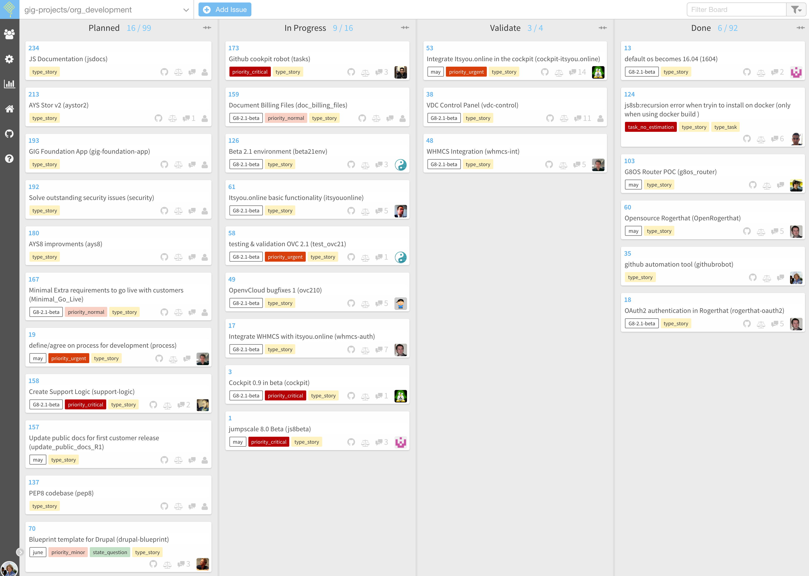

## Visualize over github (only relevant for product related repo's)

- We suggest to use https://waffle.io/ to visualize this agile methodology
- This gives you a Kanban method on top of all your stories/bugs/fr's/tickets/...

### How to use Waffle

Waffle present the issues and pull requests from one or more Github repository

We use 5 columns to categorize our works:

- Waffle can visualize stories, tasks, bugs/feature requests
- Waffle's are attached to milestone projects
- The same Waffle Kanban can visualize all mentioned categories above, use filters to select
- Waffle also allows a user to see which tasks/stories are assigned to him over multiple repo's
- For each Waffle linked to milestone we also link all relevant code repositories so we can use the same waffle to see progress on FR's & BUGS

#### Stories

- **NEW**: Stories selected for milestone but no work started yet
- **PROGRESS**: Stories which are being worked on
- **QUESTION**: Stories which need feedback and need to be discussed
- **VALIDATION**: When a story is done, the next step is to review it; this is a vey important step in our process
- **CLOSED**: After review when the solution proposed is accepted, the story is closed

#### Tasks

- **NEW**: Tasks not started yet
- **PROGRESS**: When someone is working on a task, the task is known as in progress. By looking at that column we can track on what the team is focusing on at the moment
- **QUESTION**: Task is unclear it needs attention
- **VALIDATION**: optional, sometimes a task needs to be validated
- **CLOSED**: Done

#### Bugs and feature requests

- **NEW**: Unsorted bugs/fr
- **PROGRESS**: Active people are working on it
- **QUESTION**: Need feedback
- **VALIDATION**: Being tested
- **CLOSED**: Done

### Example

